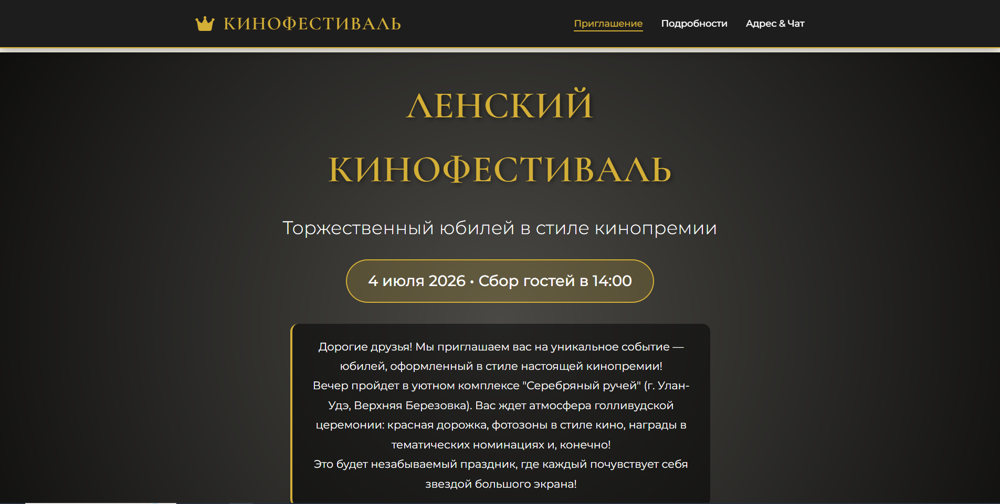

# 🎬 Веб страница с приглашением на юбилей в стиле кинофестиваля

Веб-приглашение на юбилей в стиле голливудского кинофестиваля с анимациями, интерактивными элементами и атмосферой праздничного вечера.
Это репозиторий с кодом веб-страницы для приглашения гостей на мероприятие. Страница создана для удобного информирования участников о деталях события и используется как современная альтернатива бумажным приглашениям. 

## 🌐 Посмотреть страницу

Готовая страница доступна по адресу:  
**[Вариант 1](https://likemne.github.io/priglashenie/)**

**[Вариант 2](https://likemne.github.io/priglashenie/Version2/)**


## 🖼️ Скриншот проекта



*Главная страница приглашения в стиле кинофестиваля*

## 💻 Локальный запуск

Чтобы открыть страницу на своём компьютере:

```bash
git clone https://github.com/likemne/priglashenie.git
cd priglashenie
```

 
